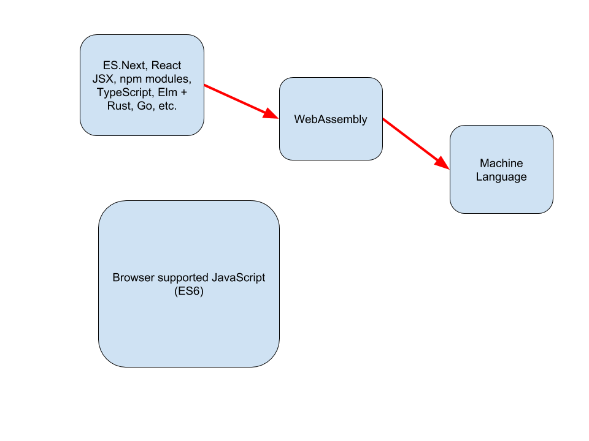

build-lists: true

# [fit][Web Assembly Dance Party](https://www.youtube.com/watch?v=ojP0BO6H4Qc)

---

# [fit]Learn a Language: Web Assembly

---

# Who is this guy? (@seanhelvey)
* M.S. Computer Science at New York University
* Web Development Instructor at Galvanize Boulder
* Teacher of JavaScript, Node.js, React, Redux
* Co-organizer of Front Range Elm Meetup

---

# I do not work for a browser vendor!
* Most talks you will find on WebAssembly are biased
* Not saying this is a bad thing, but let's be honest
* Also not trying to compile my C++ game to the web
* I'm an average web developer interested in the future

---

# Objectives
* Illustrate growth of ECMAScript
* Introduce WebAssembly (Wasm)
* Outline future vision

---

# Discuss growth of ECMAScript specification
* 1995: JavaScript created
* 1997: *110* page ECMAScript specification
* 2015: *566* page ECMAScript specification

---

---

# Back in the day

---

# 5-10 years ago

---

# Yesterday

---

# THE FUTURE (Today)

---

# Indirect flight: CO -> Europe -> Hawaii

---

# Direct flight: CO -> Hawaii

---

# A student / teacher perspective on WebAssembly
* I’ve used over 20 different languages and trust me
* Teaching JavaScript is the hardest by far
* ES5 was hard to begin with
* ES6, 7, 8, etc. making it even more difficult

---

---

# Timeline of WebAssembly developments
* March 2013 - Predecessor asm.js released
* June 2015 - WebAssembly working group formed
* November 2017 - WebAssembly MVP released
* February 2018 - W3C public draft released

---

# .wat is WebAssembly or Wasm?
* A binary instruction format for a virtual machine
* A portable target for high-level languages
* Java / JVM solved similar portability issue

---

# .wat is WebAssembly or Wasm (Cont...)
* 32 and 64 bit integer and floating point types
* File formats

---

---

# wasm-bindgen

---

# Future vision
* Is it really just for C/C++/Rust?
* Language quality race to the top
* More modularity and portability
* JavaScript (maybe) as glue code
* Choose the right tool for the job!

---

# Objectives
* Illustrate growth of ECMAScript
* Introduce WebAssembly (Wasm)
* Outline future vision

---

# Thank you!
